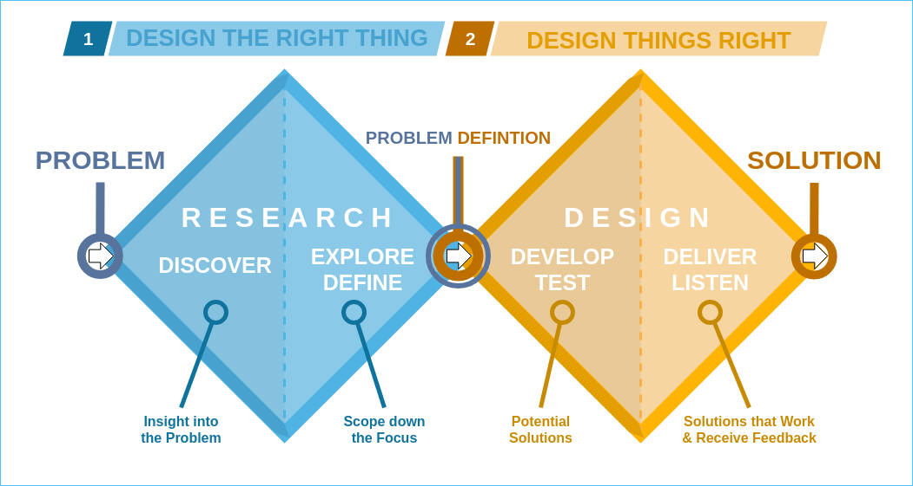

# 🌱 Predicting Food Waste By Multiple Linear Regression

## 📌 Project Overview

This project is part of the **Design Thinking Project III (DTP III)** at the Singapore University of Technology and Design (SUTD), which combines technical and humanistic lenses across three modules:
- `10.020 Data Driven World (DDW)`
- `10.022 Modelling Uncertainty (MU)`
- `02.003 Social Science (SS)`

Our goal is to model and understand the **carbon footprint associated with food waste**, particularly within the F&B sector. Using both Excel and Python, we built predictive models that are grounded in both **statistical evidence** and **social context**. We adopted the **Double Diamond Design Thinking framework** throughout this project (Discover → Define → Develop → Deliver).

---

## ❓ Problem Statement

**"How might we predict the amount of food waste generated at events or restaurants based on operational, environmental, and economic factors such as quantity of food prepared, number of guests, event type, and pricing strategy—so as to enable data-driven planning and minimize unnecessary waste?"**

---

## 🧩 Project Components

### 🔍 1. Social Science (SS)
- Explored socio-cultural causes of food waste across restaurant types (buffet vs. à la carte).
- Created **data-driven personas** to reflect stakeholders' values and constraints.
- Applied Sigmund Freud to critique how food waste narratives are shaped.

### 📊 2. Modelling Uncertainty (MU)
- Cleaned and transformed real-world datasets.
- Built a **Multiple Linear Regression (MLR)** model in Excel.
- Evaluated model using RMSE, MAE, and Adjusted R².
- Delivered a 5-page technical report and interactive Excel workbook.

### 🧠 3. Data Driven World (DDW)
- Developed a Python-based Jupyter Notebook to replicate and enhance the Excel model.
- Used `pandas`, `scikit-learn`, and `matplotlib` to preprocess, model, and visualize.
- Evaluated model improvements with training/test splits and performance metrics.

---

## 👥 Peer Contribution

| Team Member     | Contributions |
|-----------------|----------------|
| **[Zi Qi](https://github.com/ziqiqiiii)**   | DDW lead – Python modeling, data visualization, Improving Model, and Web App Building|
| **[Catherine Laura Danandjaja Antoni](https://github.com/CatherineLDA)**    | DDW lead – Python modeling, data visualization, video production |
| **[Davin Handreas Chen](https://github.com/dayeveenhc)**     | MU lead – Excel model building, data preprocessing, report writing,  SS lead – personas, literature review|
| **[Wong Jun Han, Brayden](https://github.com/omgtheburden)**  | Dataset sourcing, QA testing, coordination across tasks |
| **[Ryan Leow Heng Kuan](https://github.com/RyanLHK)**  | Dataset sourcing, QA testing, coordination across tasks |

All members actively contributed across all phases and tools, with rotating roles during iteration and feedback sessions.

---

## 🗂️ Project Structure

This repository is organized by component to reflect the interdisciplinary nature of the project:

├── README.md
├── /datasets/
├── /image/
├── /SS/
│   └── SS_presentation.pdf
├── /MU/
│   └── regression_model.xlsx
├── /DDW/
│   ├── /notebooks/ # Jupyter notebooks
│   │   └── Project Template.ipynb
│       └── /utils/
│   └── /code/ # Streamlit app + DDW README
│       ├── Home.py
│       ├── library.py
│       ├── README.md

## 📂 Data Sources

- [Food Waste Data in Restaurant](https://www.kaggle.com/datasets/trevinhannibal/food-wastage-data-in-restaurant)

## 🏁 Final Notes

This project reflects an interdisciplinary approach to tackling real-world sustainability challenges through both technical modeling and social insight. Special thanks to our instructors and the DTP III teaching team.
